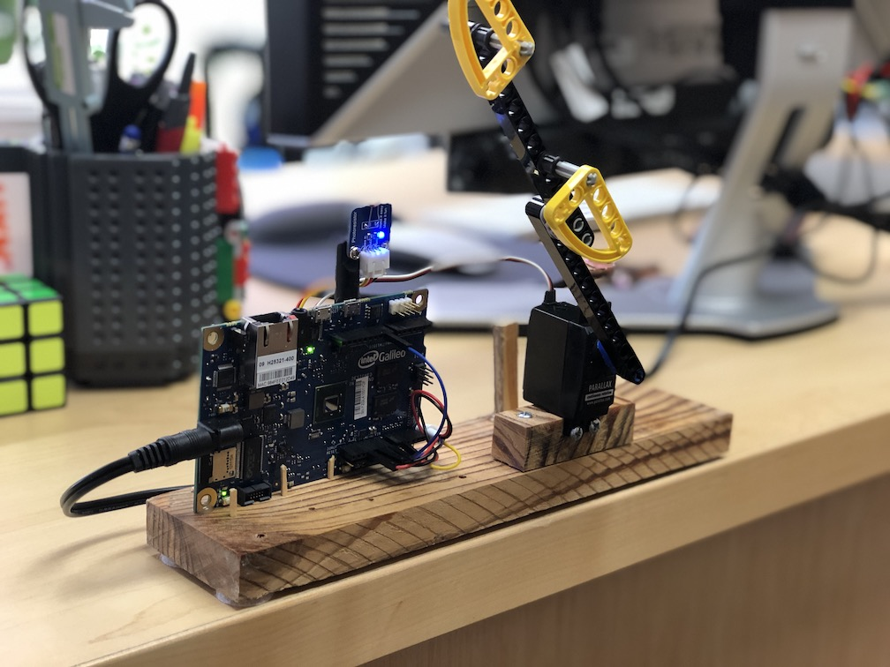

# office-light-trigger
Code tested on Intel Galileo, with servo, and photoresistor

For the connector from the servo to the lego beam printed and used "Lego Servo Adapter" from greengiant83 on Thingiverse
https://www.thingiverse.com/thing:151306

[Servo to Beam!](https://cdn.thingiverse.com/renders/e0/be/ca/80/d0/Lego_Servo_Arm_preview_tiny.jpg)

Also added the files used to get the Galileo going.

```///////////////////////////////////////////////////////
// By: Je'aime Powell 
// Rev 1 - 9/10/19
//
// Office Light Trigger
//
// Activates servo to wave arm to turn back on the motion
// controlled light
//
// Pin Connections:
// D13 - Intel Galileo LED Pin
// D9 - Servo
// A1 - Photoresistor
///////////////////////////////////////////////////////
```




